# Userdokumentation

## Inhaltsverzeichnis
 - [Userdokumentation](#userdokumentation)
   * [Inhaltsverzeichnis](#inhaltsverzeichnis)
   * [1. Quickstart](#1-quickstart)
   * [2. Der Client und seine Ansichten](#2-der-client-und-seine-ansichten)
     + [2.1 Übersicht](#21--bersicht)
     + [2.2 Ausgrabung](#22-ausgrabung)
     + [2.3 Bauaufnahme](#23-bauaufnahme)
     + [2.4 Survey](#24-survey)
     + [2.5 Bilder](#25-bilder)
     + [2.6 Import](#26-import)
     + [2.7 Export](#27-export)
     + [2.8 Einstellungen](#28-einstellungen)
   * [3. Synchronisation mit anderen Client(s)](#3-synchronisation-mit-anderen-client-s-)
     + [3.1 Synchronisation mit einem anderen Client](#31-synchronisation-mit-einem-anderen-client)
     + [3.2 Synchronisation mit mehreren Clients](#32-synchronisation-mit-mehreren-clients)
     + [3.3 Synchronisation über den Server field.dainst.org](#33-synchronisation--ber-den-server-fielddainstorg)
   * [4. Grundlegende Funktionen](#4-grundlegende-funktionen)
     + [4.1 Karten- und Listenansicht](#41-karten--und-listenansicht)
     + [4.2 Suchen](#42-suchen)
   * [5. Das Projekt](#5-das-projekt)
   * [6. Anlegen von Ressourcen](#6-anlegen-von-ressourcen)
     + [6.1 Felder](#61-felder)
     + [6.2 Relationen](#62-relationen)
     + [6.3 Zuweisen von Ober- bzw. Subtypen](#63-zuweisen-von-ober--bzw-subtypen)
   * [7. Einfügen von Messplänen aus GIS](#7-einf-gen-von-messpl-nen-aus-gis)
     + [7.1 Importieren von Multigeometrien](#71-importieren-von-multigeometrien)
     + [7.2 Verwendung von Survey 2 GIS](#72-verwendung-von-survey-2-gis)
     + [7.2 Anwendung des Parsers](#72-anwendung-des-parsers)
   * [8. Integration von Messdaten von AutoCAD zu iDAIfield 2.0](#8-integration-von-messdaten-von-autocad-zu-idaifield-20)
   * [9. Integration von 3D-Fotogrammetrien](#9-integration-von-3d-fotogrammetrien)
   * [10. Verwendung von owncloud zur Bildverknüpfung im Client](#10-verwendung-von-owncloud-zur-bildverkn-pfung-im-client)
 
 
 ## 1. Quickstart

1. Bei der Inbetriebnahme des Clients ist standardmäßig ein Projekt
„Test“ ausgewählt. Dies kann zu Testzwecken verwendet werde, wobei
angelegte Daten nach einem Neustart des Clients gelöscht werden.\
*(siehe: Abschnitt 4.1 Anlegen eines neuen Projekts)*

2. Der Benutzername sollte unbedingt eingegeben werden. Diese geschieht
unter Einstellungen: Benutzereinstellungen. Diese Information wird
ebenfalls beim Anlegen der Datensätze gespeichert.

3. Der Pfad des Bilderordner kann vom Nutzer selbst verwaltet werden.
Dies bezieht sich auf die importierten Bilder, besonders für die
Hintergrundkarten. Selbstverständlich kann hier auch der default-Pfad
bestehen bleiben. Einstellungen: Pfad zum Bildverzeichnis. Es sollte
beachtet werden, dass der letzte / gesetzt ist

4. Es ist wichtig, die Daten regelmäßig zu sichern (siehe Export), da
sich der Client gegenwärtig noch in einem Betastadium befindet. Es
handelt sich um ein frühes Release, deshalb sollte so oft wie möglich
ein Export durchgeführt werden. Das gleiche gilt selbstverständlich für
die Bilder.

5. Es sollte ein eigenes Projekt angelegt werden\
*(siehe: Abschnitt 4.1 Anlegen eines neuen Projekts)*

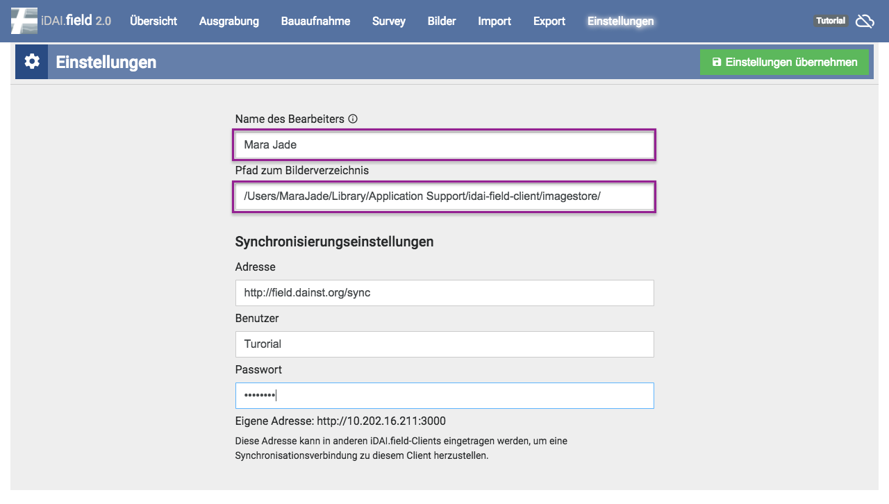
*Abb. 1: Anlegen eines neuen Projekts. Eingabe des Bearbeiters/der Bearbeiterin*

**Jetzt kann es losgehen. Viel Erfolg!**

## 2. Der Client und seine Ansichten

*Abb. 2: Der Übersichtsbildschirm*

Startseite des Clients. In diesem Bereich werden die verschiedenen Menü-Ebenen beschrieben. Rechts oben wird angezeigt, ob der Client zu einem anderen oder zum Server synchronisiert 
sowie der Projektname (Tutorial).\
*(siehe: Abschnitt 5 Das Projekt, Abschnitt 3 Synchronisation mit anderen Client(s))*

### 2.1 Übersicht

Der Übersichts-Bildschirm: Hier können Ressourcen
angelegt werden und das gesamte Projekt überblicksartig betrachtet
werden. Das Anlegen von Ressourcen geschieht über den  Button. Hier
können nur Haupttypen angelegt werden. Schnitte, Bauaufnahmen, Survey
Areale und Orte.\
*(siehe: Abschnitt 6 Anlegen von Ressourcen)*

### 2.2 Ausgrabung

Der Ausgrabungs-Bildschirm: Hier können alle Ressourcen
innerhalb von Schnitten eingesehen und bearbeitet werden. Die Zuordnung
zum Schnitt wird automatisch vorgenommen, weitere Ressourcen werden
immer innerhalb eines Schnittes angelegt.
Jede Ressource kann ausgewählt werden, auf der rechten Seite wird eine
Übersicht der eingetragenen Felder und deren Attribute angezeigt. Das
Anlegen von Ressourcen geschieht über den  Button. Zudem können
weitere Schnitte hinzugefügt  und bearbeitet werden .\
*(siehe: Abschnitt 6 Anlegen von Ressourcen)*

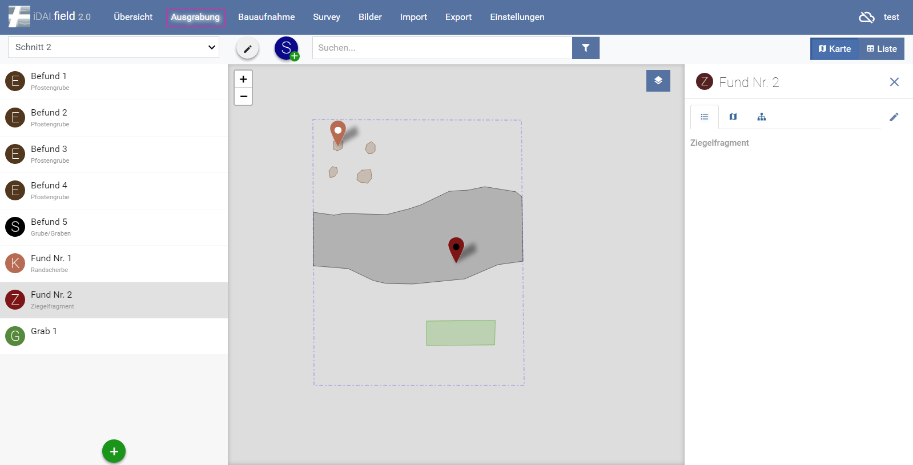
*Abb 3: Der Ausgrabungs-Bildschirm*

### 2.3 Bauaufnahme

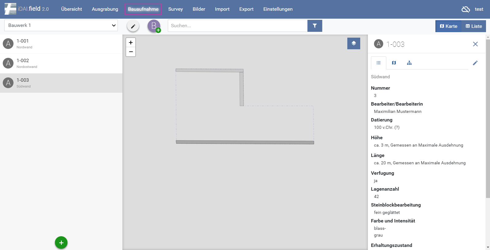
*Abb 4: Der Bauaufnahme-Bildschirm*

Der Bauaufnahme-Bildschirm: Hier können alle Ressourcen innerhalb von
Bauaufnahmen eingesehen und bearbeitet werden. Die Zuordnung zur
Bauaufnahme wird automatisch vorgenommen, weitere Ressourcen werden
immer innerhalb einer Bauaufnahme angelegt.
Jede Ressource kann ausgewählt werden, auf der rechten Seite wird eine
Übersicht der eingetragenen Felder und deren Attribute angezeigt. Das
Anlegen von Ressourcen geschieht über den  Button. Zudem können
weitere Bauaufnahmen hinzugefügt  und bearbeitet werden
.\
*(siehe: Abschnitt 6 Anlegen von Ressourcen)

### 2.4 Survey

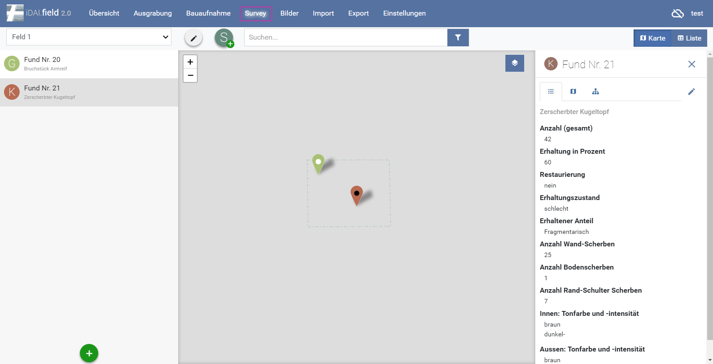
*Abb 5: Der Survey-Bildschirm

Der Survey-Bildschirm: Hier können alle Ressourcen innerhalb eines
Survey-Areals eingesehen und bearbeitet werden. Die Zuordnung zum
Survey-Areal wird automatisch vorgenommen, weitere Ressourcen werden
immer innerhalb eines Survey-Areals angelegt.\
Jede Ressource kann ausgewählt werden, auf der rechten Seite wird eine
Übersicht der eingetragenen Felder und deren Attribute angezeigt. Das
Anlegen von Ressourcen geschieht über den  Button. Zudem können
weitere Survey-Areale hinzugefügt  und bearbeitet werden
.\
*(siehe: Abschnitt 6 Anlegen von Ressourcen)*

### 2.5 Bilder

\
*Abb 6: Typauswahl der Abbildung*

Hier können Abbildungen hinzugefügt werden. Nach dem Klicken auf den
„Abbildung hinzufügen“ Bereich, erfolgt eine Auwahl über den Browser.
Nur das .jpg-Format wird gegenwärtig unterstützt. Alternativ die Bilder
per drag-and-drop fallen lassen. Bitte beachten Sie, dass der image-Pfad
gesetzt ist *(siehe: Quickstart)*\
Nun kann ausgewählt werden, ob es sich um eine Zeichnung, Fotografie
oder Abbildung handelt (Abb. 6)\
Nun kann die Abbildung mit einer oder mehreren Ressourcen verknüpft werden .\
Anschließend kann die abgebildete Ressource ausgewählt werden (Abb. 7/8). 

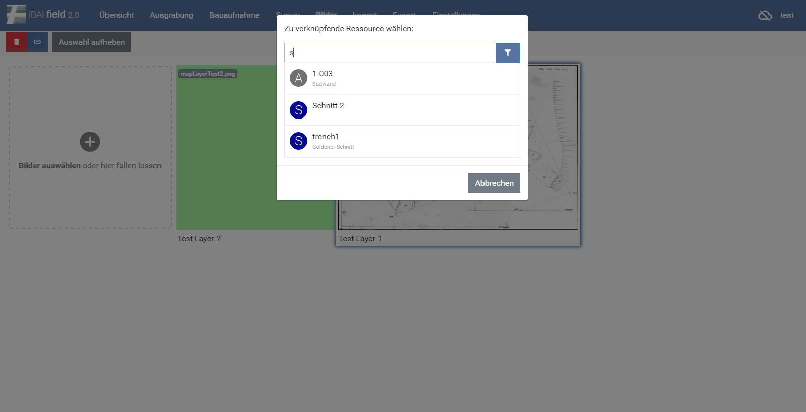
*Abb 7: Zuweisung von Ressourcen*

Zudem können selbstverständlich mit  weitere 
Fotoattribute eingetragen werden. Ein weiteres Feature ist die Zuweisung
von Georeferenzdaten (Abb. 9.1), um Hintergrundkarten zu erstellen.
Hierfür wird eine Rastergrafik (.jpg) und eine .wld-Datei benötigt,
welche die Koordinaten des Bildes enthält. Durch den Klick auf  kann
das .wld hinzugefügt werden. Nun ist es als Hintergrundkarte verfügbar
und kann in den verschiedenen Bildschirmen aus- oder angeschaltet
werden. Anschließend ändert sich die Anzeige bei Georeferenzdaten in .\
Wichtig ist hier, dass eine Kurzbeschreibung vorhanden ist, welche als
Überschrift der Basiskarten verwendet wird.

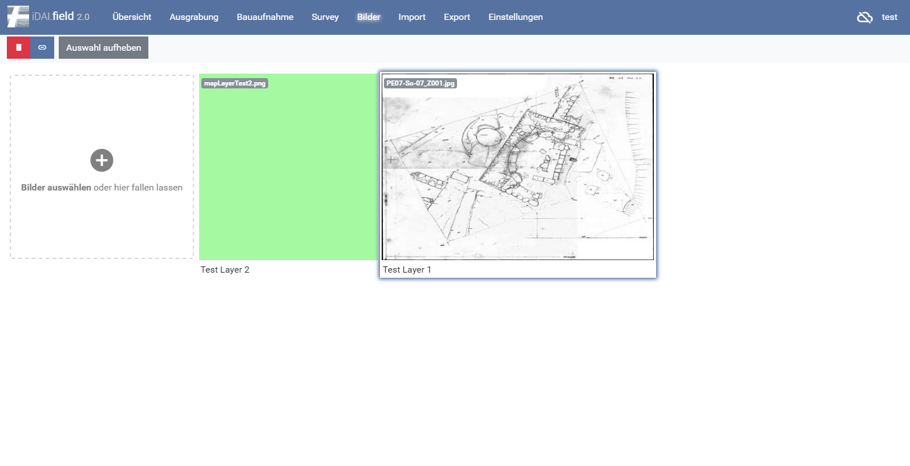
*Abb 8: Foto mit verknüpfter Ressource*

*Abb 9: Hintergrundkarte*

\
*Abb 9.1: Georeferenzbildschirm*

Jeder Layer kann an- und ausgeschaltet  und zentriert
 werden.

Soll solch eine Verknüpfung gelöscht werden, muss die
Abbildung unter dem Reiter Bilder doppelt angeklickt werden. Alternativ
kann über die verknüpfte Ressource darauf zugegriffen werden, indem man
hier das Bild vergrößert. In beiden Fällen stehen am rechten Rand die
Bildinformationen zur Verfügung. Über  und den Reiter „Relationen“
lassen sich die Verknüpfungen anzeigen und löschen.

### 2.6 Import

Der Import lässt verschiedene Dateitypen zu (Quelle: Datei). Der Pfad
für die betreffende Datei muss ausgewählt werden. Im Falle eines Imports
aus einer iDAI.field-Datei (jsonl) kann der Import ohne weitere
vorherige Maßnahmen durchgeführt werden. Soll eine GEOjson importiert
werden, ist ein Feld „identifier“ in der Datei **notwendig.** Zudem muss
die Ressource bereits im Client existieren, mit identischem Bezeichner.
Anschließend erfolgt eine Meldung, wie viele Ressourcen importiert
wurden. Existiert die Bezeichnung des Feldes „identifier „ als
Ressource, wird diese automatisch den eingeladenen Zeichnungen
zugeordnet.

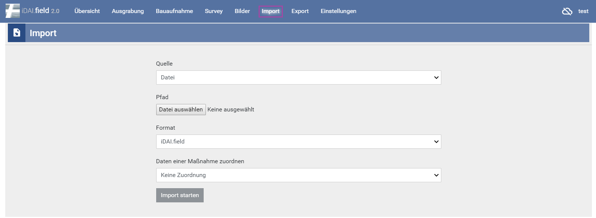
*Abb 10: Importfenster*

### 2.7 Export

Hier kann das gesamte Projekt exportiert werden. Die Dateiendung ist
.jsonl. Diese kann bequem in den Client importiert werden, auch ohne das
vorherige Anlegen von Ressourcen.

*Abb. 11: Exportfenster*

### 2.8 Einstellungen

Im Einstellungs-Fenster wird der/die aktuelle BenutzerIn, also
BearbeiterIn eingetragen. Diese Information wird automatisch in die
Datensätze geschrieben. Das Feld sollte nicht leer bleiben.\
*(siehe: Abschnitt 3 Synchronisation mit anderen Clien(s))*

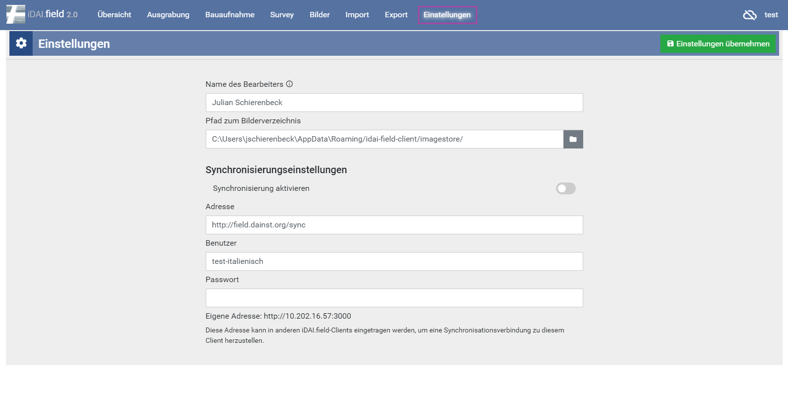
*Abb. 12: Einstellungsfenster*

## 3. Synchronisation mit anderen Client(s)

Der Client kann stets mit einem, oder mehreren anderen Clients verbunden
und Synchronisiert werden. Das Symbol  zeigt an, ob der Client
derzeit verbunden ist. Durchgestrichene Wolke: Keine Verbindung. Durch einfaches klicken auf die Wolke werden die Synchronisationseinstellungen aufgerufen.

### 3.1 Synchronisation mit einem anderen Client

Über den Reiter Einstellungen werden die
„Synchronisierungseinstellungen“ eingegeben. Die Felder „Benutzer“ und
„Passwort“ sind bei einer einfachen Verbindung nicht erforderlich. Nur,
wenn zu einem Server Synchronisiert wird, muss der Projektname
eingetragen werden.\
Die Synchronisation läuft so lange, bis die Adresse aus dem Feld
gelöscht und die Einstellungen übernommen werden.

### 3.2 Synchronisation mit mehreren Clients

Bei der Synchronisation mit mehreren anderen Clients existieren zwei
Möglichkeiten.\
Im ersten Fall synchronisieren mehrere Rechner zu einem Masterclient und
geben hierfür alle die Adresse dieses Clients in den Einstellungen an.\
Im Zweiten Fall bilden mehrere Rechner eine Kette und der erste
synchronisiert zum zweiten, dieser zum dritten u.s.w. Hierfür wird die
Adresse des jeweils nächsten in den Einstellungen verwendet. Das
Synchronisieren untereinander ist zwar bei zwei Clients möglich, könnte
allerdings zu fehlern führen.

### 3.3 Synchronisation über den Server field.dainst.org

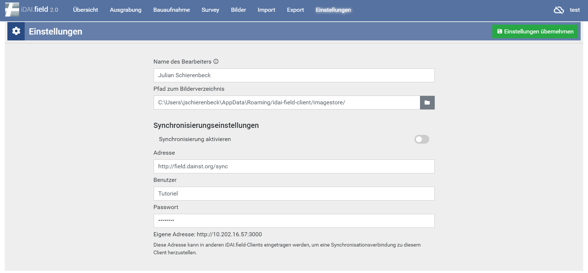
*Abb 13: Synchronisationseinstellungen*

Zuerst müssen die Mitarbeiterinnnen und Mitarbeiter des
IT-Referats des DAI ein Projekt auf dem Server anlegen. Bei der
Synchronisation mit dem Server ist es weiterhin nötig, dass die
spezifische Serveradresse eingetragen wird.

http://field.dainst.org/sync

Der Name des Projektes muss in diesem Fall im Benutzerfeld stehen und
das Passwort ist standardmäßig der Name des Projekts.
Zudem muss der Name des Projektes mit dem auf dem Server angelegten
Projekt übereinstimmen.

## 4. Grundlegende Funktionen

### 4.1 Karten- und Listenansicht

In der oberen, rechten Ecke kann zwischen einer Karten- und einer
Listenansicht unterschieden werden. Die Kartenansicht (Standard) zeigt
hier die eingegebenen oder importierten Strukturen der Ressourcen und
alle eingelesenen Karten an.

In der Listenansicht erhält der Nutzer eine tabellarische Ansicht aller
angelegten Ressourcen\
Die erste Übersicht enthält hierbei eine kleine Auswahl an Informationen
wie die Bezeichnung und die Kurzbeschreibung.

### 4.2 Suchen

In der Suchleiste ist es möglich, nach Namen von Ressourcen oder nach
Teilbegriffen zu suchen.\
Bei Eingabe reduziert sich die Anzahl der angelegten Ressourcen bis das
gesuchte übrig bleibt.\
Bei der Anwendung der Filter werden alle Ressourcen aus dem ausgewählten
Filter angezeigt.

## 5. Das Projekt

Zu Beginn der Arbeiten, nach der Installation des Clients ist die
Datenbank leer.\
Die Bereiche im Hauptbildschirm sind ohne Funktion.\
Im rechten Bereich, neben , muss durch einfaches Klicken das Feld zum
„Projekte verwalten“ aufgerufen werden.\
Hier kann unter bereits bestehenden Projekten eine Auswahl getroffen
werden.
Über  kann ein neues Projekt angelegt werden.
Im nebenstehenden Stiftsymbol  kann das Bearbeitungsfenster des
Projektes erneut aufgerufen werden. Informationen lassen sich
nachtragen oder ändern.
Das Symbol  löscht ein Projekt. Die Eingabe des Projektnamens in die
Zeile ist nötig zur Bestätigung. Das Projekt ist nachfolgend endgültig
gelöscht.

*Abb. 14: Anlegen eines neuen Projekts*

## 6. Anlegen von Ressourcen

Je nach Reiter, Ausgrabung, Bauaufnahme oder Survey, wird über das
Symbol  im linken Bereich der zweiten Zeile ein neuer Schnitt, neues
Bauwerk oder Survey angelegt.
Nach dem Speichern der Ressource wird diese im Auswahlfenster links
angezeigt. Hier kann zwischen verschiedenen Schnitten, Bauwerken oder
Surveys gewechselt werden. Das  ermöglicht die weitere Bearbeitung
der Ressource.\
Ist eine Hauptressource angelegt können im linken Bildschirmabschnitt
über das  neue Ressourcen hinzugefügt werden. Diese beinhalten unter
anderem Befunde, Funde, Gräber, Architektur, Bohrungen, Proben u.s.w.\
Jedes ist mit einem eigenen Symbol mit Anfangsbuchstaben gekennzeichnet.

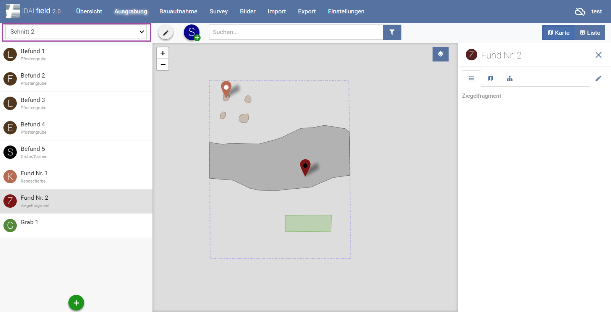

*Abb. 15: Anlegen von Hauptressourcen*

Bei der Auswahl einer neuen Ressource öffnet sich das Fenster zur
Eingabe einer Geometrie und nach der Auswahl, dass Fenster zur
Dateneingabe.

### 6.1 Felder

Unter manchen Feldern findet ein Feld ohne Eingabemöglichkeit mit einem
kleinen, grauen „Hinzufügen“ und einem . Dies öffnet ein weiteres
Fenster zur Eingabe exakter Information. Das Eingeben mehrerer Felder
ist hier möglich.
In manchen Feldern muss eine Auswahl aus einer bestehenden Tabelle
gewählt werden.
Hier werden durch die Eingabe von Anfangsbuchstaben Vorschläge gemacht.
Einige Felder gestatten nur die Eingabe von Informationen in einem
speziellen Format.
Die Eingabe eines Wortes in einem Feld, welches nur Zahlen zulässt führt
z.B. zu der Fehlermeldung , welche lediglich bedeutet, dass eine
Information nicht im korrekten Format eingegeben wurde.

### 6.2 Relationen

Beim Doppelklick auf eine Ressource, öffnet sich das
Bearbeitungsfenster.
Unter dem Reiter „Relationen“ können diese für die
Ressource, in Verbindung zu anderen, eingetragen werden.\
Unter den verschiedenen Auswahlmöglichkeiten befindet sich ein 
Button. Durch einfaches Klicken öffnet sich ein Textfeld. Hier kann die
Bezeichnung einer anderen Ressource eingegeben werden. Automaitische
Vorschläge von den bereits bestehenden werden hier angezeigt. Einfaches
Klicken darauf lässt die Relation entstehen.\
Roter Button  zur linken löscht die Relation.

### 6.3 Zuweisen von Ober- bzw. Subtypen

Es ist möglich, Ressoucen vom Typ Stratigrafische Einheit beispielsweise
einem spezielleren Typ zuzuweisen (beispielsweise Grab). Dies trifft nur
auf Ressourcen des gleichen Typs zu.\
Hier entstehen dann zusätzliche Felder.

## 7. Einfügen von Messplänen aus GIS

Wie im *(Abschnitt 2.6 Import)* bereits beschrieben ist es möglich GEOjson Dateien
in die Datenbank einzuladen. Dies betrifft in der Regel Pläne und ist
die vorgesehen Methode um Messpläne aus einem GIS in die Datenbank zu
überführen. Hierfür muss ein „identifier“- Feld im Layer existieren und
dieses Muss als Ressource angelegt sein. Stimmt die Eingabe im
identifier-Feld mit der Ressource überein, so wird die Geometrie
automatisch zu dieser zugeordnet.\
Ein GEOjson kann im bspl. Im QGIS einfach erstellt werden in dem per
Rechtsklick auf den Layer „Speichern als“ und dann GEOjson ausgewählt
wird.

*Abb. 16: Speichern als GEOjson*

### 7.1 Importieren von Multigeometrien

Sollten Fälle auftreten, bei denen es notwendig ist mehrere Strukturen
einer Ressource mit einem identifier zuzuordnen, dann müssen diese
Geometrien als Multigeometrien ausgegeben werden. Diese können im
Anschluss als geoJSON in den Client importiert werden. Wird hingegen
eine Datei eingeladen, welche aus mehreren Geometrien besteht, welche
einfach denselben identifier besitzen, dann wird die vorherige Geometrie
überschrieben und die letzte, importierte Geometrie wird im Client
angezeigt.\
Für das Ausgeben von Multigeometrien gibt es in QGIS einen einfachen
Weg. Über den Reiter „Vektor“ und der Auswahl „Geometrie-Werkzeuge“
wählt man das Werkzeug: „Ein- zu Mehrteilig“ oder im englischen „single
part to multipart“.\
Hier muss zunächst der Eingabelayer, also der Layer welcher
zusammengelegt werden soll, ausgewählt werden. Zum zweiten wird das
Schlüsselfeld ausgewählt. Hier ist es notwendig das vorher angelegte
Feld des identifiers zu wählen, da dieses Feld übertragen wird und man
die Ausgabedatei direkt in den Client laden kann. Im letzten Feld wird
der Speicherort festgelegt und das Speichermedium geoJSON ausgewählt.
Mit Run wird der Prozess in Gang gesetzt. Das gespeicherte geoJSON kann
nun als Multigeometrie in den Client importiert werden.

*Abb. 17: Ein- zu Mehrteilig, QGIS*

### 7.2 Verwendung von Survey 2 GIS

Für die Umsetzung einer Messung in GIS kann das Programm Survey 2 GIS
verwendet werden. Dies setzt eingemessene Strukturen in GIS um, erstellt
Geometrien und trennt nach Layern.\
Für die Verwendung ist ein Parser notwendig, der gegebenenfalls an die
eigene Datenaufnahme angepasst werden muss.\
Eigene Daten werden im Feld „Eingabe“ in das Programm eingelesen. Im
Darunter liegenden reiter „Parser-Schema“ wird der Parser ausgewählt.
Weitere Einstellungsmöglichkeiten und Erklärungen sind ausführlich im
offiziellen Handbuch zu finden, welches zweisprachig jeder Survey 2 GIS
Version als PDF beiliegt.

*Abb. 18: Arbeitsoberfläche Survey 2 GIS*

### 7.2 Anwendung des Parsers

Ein Parser besteht aus zwei Bereichen. Der erste betrifft die allgemeine
Arbeitsweise des Parsers, der zweite besteht aus verschiedenen Blöcken.
Hierbei steht jeder Block für einen einzelnen Abschnitt im Messcode.\
Für dieses Beispiel wurde der Max Beispiel Parser verwendet.

**[Parser]**

name = survey2gis sample for mode "Max" **Name des Parsers.**

tagging_mode = max **Welcher Modus, max, min, end, oder none.**

tag_field = TAG **Benennung des Geometrie Feldes**

key_field = ID **Benennung des Schlüssel Feldes. Bezeichnet das Feld, in
dem sich die Kennummer der Geometrie befindet. Alle Messpunkte einer
zusammengehörenden Geometrie benötigen dieselbe Benennung.**

key_unique = Yes **Mit Angabe dieses Feldes wird festgelegt, dass alle
Messdateien mit demselben Schlüsselwert auch ein gemeinsamer
Attributsatz zugeordnet wird.**

tag_strict = No

no_data = -1

geom_tag_point = "." **Einzelne Punktmessungen mit dem Code .**

geom_tag_line = "$" **Linienmessungen mit dem Code $**

geom_tag_poly = "@" **Polylinien mit dem Code @**

coor_x = COORX

coor_y = COORY** Benennung der Koordinatenfelder**

coor_z = COORZ

comment_mark = # **# Markierter Text ist Kommentar und wird nicht mit
berechnet.**

*Im Anschluss folgen **[Field]** Felder bei denen jedes
einzelne für eine Zeile in der Spalte steht.*

**67 1_GR_W_0_@_0 X 3513037.664 Y 5279881.392 Z 399.563**

**Messcode**

**Für die 67:**

[Field]

name = IDX **Name des Field Feldes. Jedes dieser Felder bekommt einen
Namen. IDX steht hier für die Indexnummer. Eine durchgehende Messnummer
die jede Messung braucht. Daher auch im Infofeld die Nachricht von 0 bis
n.**

info = Field with measurement index [0..n] **Info.**

type = integer **Typ ist Ganzzahl.**

empty_allowed = No **Feld darf nicht leer sein.**

separator = space **Spaltentrenner ist Leerzeichen.**

merge_separators = Yes **Dürfen mehrere aufeinanderfolgende Trenner als
einer behandelt werden, also mehrere Leerzeichen wie eins.**

unique = Yes **Wenn ja, dann wird überprüft ob der Wert mehrfach vergeben
wurde.**

**Für die 1:**

[Field]

name = LEVEL **Name: Level als Angabe: Hier steht die Planumsnummer**

info = N/A **Info: Nicht angegeben**

type = Integer **Typ ist eine Ganzzahl**

empty_allowed = No **Feld darf nicht leer sein**

separator = _ **Trenner zum NÄCHSTEN Feld ist ein Unterstrich**

merge_separators = No **Mehrere Trenner sind hier nicht zulässig**

**Für das GR:**

[Field]

name = TYPE **Name: Hier steht der Typus der Linie oder des Fundes**

info = N/A **Info: Nicht angegeben**

type = Text **Typ ist ein Textfeld**

empty_allowed = No **Darf nicht leer sein**

separator = _ **Trenner zum NÄCHSTEN Feld ist ein Unterstrich**

merge_separators = No

change_case = upper **Gibt an, dass der Inhalt der Textfeldes in
Großbuchstaben umgewandelt und ausgeschrieben werden soll, wenn hier
nachfolgend durch @ markiert eine diesbezügliche Angabe gemacht wird.**

@AU = Gold **AU würde also als GOLD ausgeschrieben werden.**

@AG = Silver

@KE = Pottery

**Für das W:**

[Field]

name = AUX **Name: AUX. Weist auf ein Hilfsfeld hin**

info = N/A

type = Text

empty_allowed = No

separator = _

merge_separators = No

change_case = upper

@P = Control point **Feld ist angelegt, damit der Buchstabe P in CONTROL
POINT umgewandelt wird.**

**Für die erste 0:**

[Field]

name = FEAT **Name: FEAT steht für feature number. Befundnummer**

info = N/A

type = Integer

empty_allowed = No

separator = _

merge_separators = No

**Für das @ Zeichen:**

[Field]

name = TAG **Name TAG. Geometrie tag. Angabe um welche Art es sich
handelt. Wird im Hauptbereich des Parsers festgelegt. @ = Polylinie,
Punkt wäre ein Punkt usw.**

info = N/A

type = Text

empty_allowed = No

separator = _

merge_separators = No

skip = Yes **Skip Yes bedeutet, dass das Feld zwar berechnet, jedoch
nicht n der Ausgabedatei gespeichert wird. Es wird geskippt, da es nur
für die Berechnung wichtig ist.**

**Für die zweite 0:**

[Field]

name = ID **Name: Besonderes ID Feld, wird durch den Hauptbereich als
Schlüsselfeld festgelegt. Gibt an die wievielte Linie man zeichnen
lässt. Hier im bspl die 0. **D**ie Nächste Struktur wäre 1, die darauf 2
usw.**

info = N/A

type = Integer

empty_allowed = No

separator = space **Angabe, dass der Trenner wieder ein Leerzeichen
ist.**

merge_separators = YesA **ngegeben, dass die Menge der Leerzeichen egal
ist.**

unique = Yes **Hier wird wieder überprüft, ob der Wert mehrfach vergeben
wurde, da man ja jede Struktur nur einmal zeichnen lassen kann.**

**Für die nachfolgenden Spalten der X Koordinaten**

[Field]

name = XLABEL **Dieses Feld für das X vor den Koordinaten**

info = Useless field **welches nur mit X benannt ist.**

type = text

empty_allowed = No

separator = space

merge_separators = Yes

skip = Yes

**Für das Koordinatenfeld der X Koordinaten**

[Field]

name = COORX **Angabe aus dem Hauptbereich. Hier X Koordinaten**

info = Holds X coordinate

type = double

empty_allowed = No

separator = space

merge_separators = Yes

**Für die nachfolgenden Spalten der Y Koordinaten**

[Field]

name = YLABEL **Dieses Feld für das Y vor den Koordinaten**

info = Useless field **welches nur mit Y benannt ist.**

type = text

empty_allowed = No

separator = space

merge_separators = Yes

skip = Yes

**Für das Koordinatenfeld der Y Koordinaten**

[Field]

name = COORY **Angabe aus dem Hauptbereich. Hier X Koordinaten**

info = Holds Y coordinate

type = double

empty_allowed = Noseparator = spacemerge_separators = Yes

**Für das Feld der Z Koordinaten ebenfalls zwei Field Felder benötigt.
Mit den vorherigen beinahe baugleich, mit der Ausnahme, dass im letzten
Feld kein Seperator Feld, also kein Trennungsfeld, mehr vorhanden sein
darf.**

Natürlich muss man sich beim Verwenden von Survey2GIS nicht strikt an
diese Art des Parsers oder aber die damit verbundene Benennung von
Messungen halten.

Es ist natürlich möglich einen eigenen Vermessungscode zu verwenden und
dann den Parser anzupassen.

Wichtig ist, dass jeder einzelne Teilbereich einer Zeile mit einem
[Field] Feld belegt ist, sodass das Programm dieses berechnen kann.

Man geht von links nach rechts vor und schreibt für jeden Abschnitt der
Codezeile das entsprechende Feld.

Auch weitere, hier nicht genannte Befehle existieren und können im
Handbuch nachgesehen werden.

Wichtig: Die genannten Trennungszeichen müssen eingehalten werden,
ebenso wie deren Anzahl, wenn das Feld merge_seperators mit No
angegeben wurde.

## 8. Integration von Messdaten von AutoCAD zu iDAIfield 2.0

Bei der Integration von Daten aus CAD müssen diese zuvor in GIS geladen
und von dort in das Format geoJSON überführt werden, damit die Datenbank
diese Messdateien aufnehmen kann.\
QGIS ist in der Lage DXF.-Dateien zu laden. Jedoch sind ein paar weitere
Arbeiten notwendig.\
Zum ersten muss die Datei als DXF. Vorliegen. Diese kann als Vektorlayer
im GIS geladen werden.\
Dieser Layer muss als shape (shp.) gespeichert werden. Über den Reiter
„Vektor“ muss im Unterpunkt „Geometrie-Werkzeuge“ die Anwendung
„Geometrie Prüfen“ ausgewählt werden. Ist diese nicht vorhanden muss sie
als Plugin installiert oder/und zugeschaltet werden.\
Im Anschluss muss ein neues GRASS-Mapset erstellt werden. Der
Eingabelayer muss ausgewählt und ein Ausgabelayer definiert werden. Nach
drücken des „Start“ Buttons, kann das Ergebnis visualisiert werden.

\
*Abb. 19: Geometrien Prüfen*

Vor dem umwandeln in Polygone muss die Datei durch das Tool bearbeitet
werden. Hier werden alle noch frei stehenden Linien geschlossen, sodass
sie weiter verarbeitet werden können.

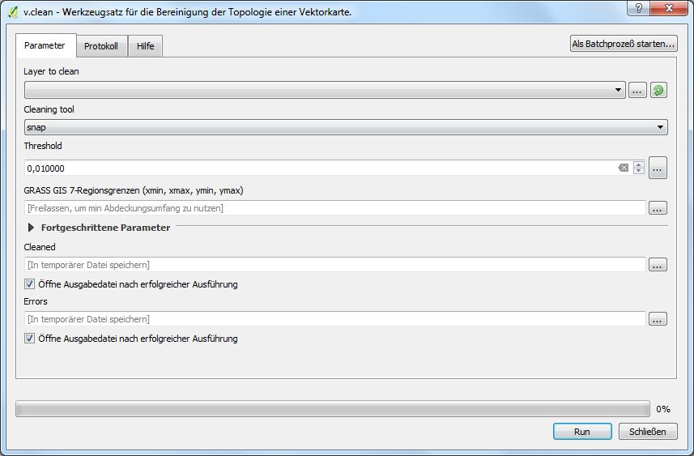
*Abb. 20: v.Clean Bereinigungswerkzeug*

Im Reiter „Cleaning Tool“ muss snap eingestellt sein. Dies ist nicht der
Standard. Bei „Threshold“ wird die Entfernung eingegeben in welcher
Linien gesnapt werden, Diese darf nicht zu groß sein, empfohlen wird
hier 0,001 (10 cm). Es kann jedoch notwendig sein, diese Entfernung auf
die eigenen Daten an zu passen.\
Die so entstandenen Layer können mit dem Tool „Linien zu Plygonen“, zu
finden unter dem Reiter Vektor und dem Bereich Geometrie-Werkzeuge, in
Polygone umgewandelt werden.

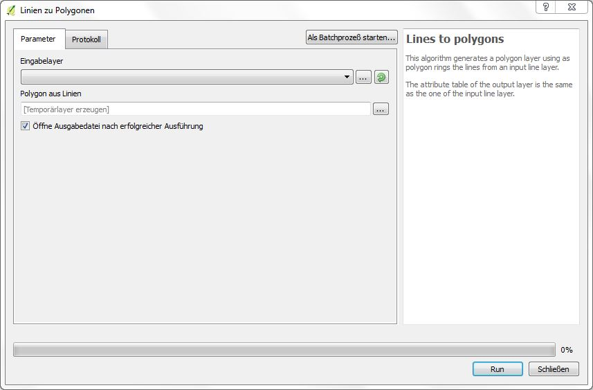
Abb. 21: Linien zu Polygonen

Ein Problem stellen fehlende Außenlinien dar. Diese sind bei manchen
CAD-Zeichnungen nicht unbedingt vorhanden, wie im unten angegebenen
Beispiel. Hier muss für den Befund 026 eine Außenlinie definiert werden.
Dies muss leider händisch erfolgen und ist vor der Anwendung Linien zu
Polygon vor zu nehmen.

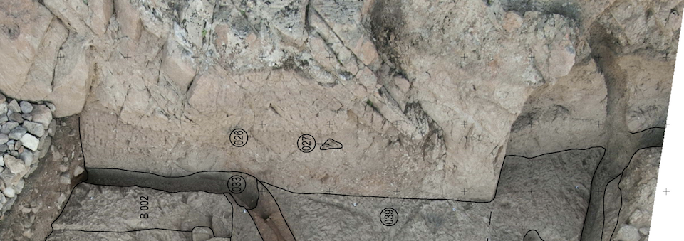
Abb. 22: Beispiel CAD-Plan

Für die Integration in den iDAIfield Client müssen die Layer natürlich
mit einem Identifier-Feld versehe werden. Sollen Befundnummern mit
übertragen werden ist das anlegen von Punktlayern zu diesem Zweck ein
einfacher Weg.

## 9. Integration von 3D-Fotogrammetrien

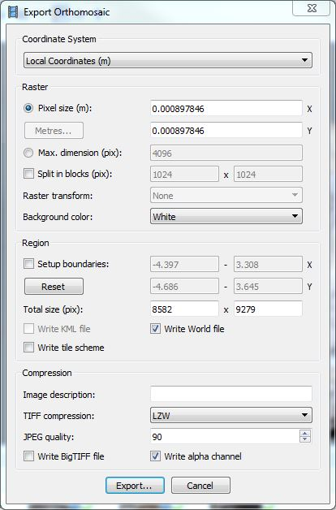\
*Abb. 23: Exporteinstellungen*

Im Anschluss der Berechnung des 3D Modells, hier im
Beispiel mit Agisoft PhotoScan, muss ein Orthophoto generiert und
entsprechend als jpeg. ausgegeben werden. Dieses kann problemlos in den
Client geladen werden.

Bei der Verwendung von Messmarkern, kann eine World file-Datei mit
ausgegeben werden. Diese wld. kann im Client zur georeferenzierung
verwendet werden.

Unter dem Reiter „Workflow“ wird hier die Funktion „Build Orthomosaic“
ausgewählt. Dieses ist bei Photoplan erst nach dem Speichern des Modells
möglich.\
Im Anschluss findet sich unter dem Reiter „File“ die
Anwendungsmöglichkeit „Export Orthomosaic“ und die Wahlmöglichkeit
Export JPEG/TIFF/PNG…

Hier muss im Kästchen von „Write World file“ das Häkchen gesetzt sein.\
Nach dem klicken auf „Export“ wird ein Speicherort ausgewählt und der
Dateityp festgelegt.

## 10. Verwendung von owncloud zur Bildverknüpfung im Client

Zur einfacheren Bildverknüpfung mit dem Server kann ein Ordnerpfad über
owncloud angelegt werden. Dies hat den Vorteil, dass alle beteiligten
auf die originalen Bilddaten zugriff haben.\
Die owncloud greift auf den Server des DAI zu und Synchronisiert alle
Bilder zum Projektordner.

\
Abb. 24: Eingabe der Serveradresse

Nach der Installation wird die DAI Cloud als Ziel ausgewählt.
Nachfolgend werden die DAI internen Zugangsdaten abgefragt.\
Nach erfolgreichem Log in wird dem Nutzer eine Ordnerauswahl zur
Verfügung gestellt. Wählen Sie den Ordner ihres Projektes aus.

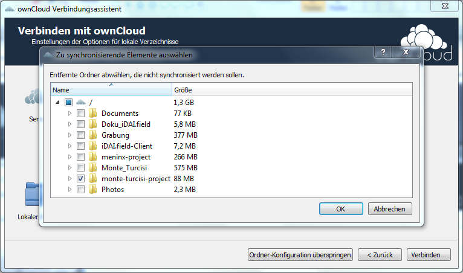\
Abb. 25: Auswählen des Ordners

Die Synchronisation läuft nun zu diesem Order. Ändern Sie den Zielordner
der Bilder im Client unter „Einstellungen“.

