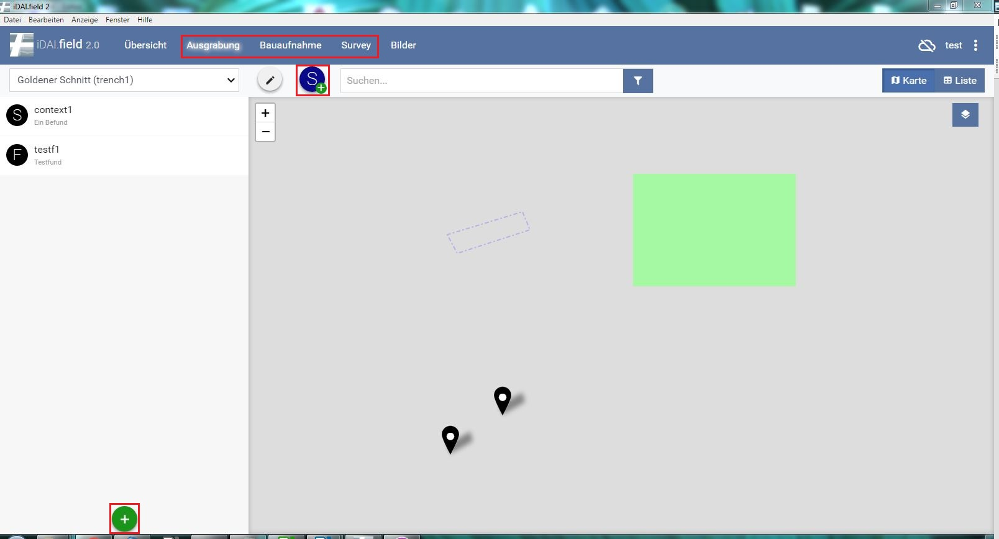
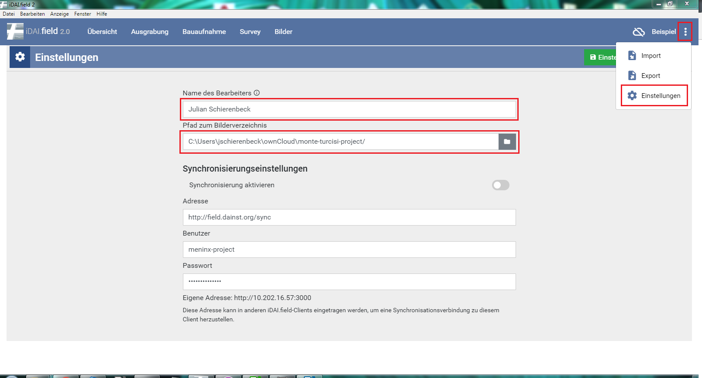

## 2. Der Client und seine Ansichten

*Abb. 2: Der Übersichtsbildschirm*

Startseite des Clients. In diesem Bereich werden die verschiedenen Menü-Ebenen beschrieben. Rechts oben wird angezeigt, ob der Client zu einem anderen oder zum Server synchronisiert 
sowie der Projektname (Beispiel).\
*(siehe: Abschnitt 7 Das Projekt, Abschnitt 5 Synchronisation mit anderen Client(s))*

### 2.1 Übersicht

Der Übersichts-Bildschirm: Hier können Ressourcen
angelegt werden und das gesamte Projekt überblicksartig betrachtet
werden. Das Anlegen von Ressourcen geschieht über den  Button. Hier
können nur Haupttypen angelegt werden. Schnitte, Bauaufnahmen, Survey
Areale und Orte.\
*(siehe: Abschnitt 8 Anlegen von Ressourcen)*

### 2.2 Maßnahme

Die drei Maßnahmen Ausgrabung, Bauaufnahmen und Survey, werden über gleichnamige Reiter in der oberen Leiste ausgewählt.\
In diesen Bereichen können alle Ressourcen eingesehen und bearbeitet werden. Die Zuordnung zur Maßnahme erfolgt automatisch, weitere Ressourcen werden immer innerhalb einer Maßnahme angelegt.\
Jede Ressource kann ausgewählt werden, auf der rechten Seite wird eine
Übersicht der eingetragenen Felder und deren Attribute angezeigt. Das
Anlegen von Ressourcen geschieht über den  Button. Zudem können
weitere Schnitte, Bauaufnahmen oder Surveys über ,  und
 hinzugefügt und bearbeitet werden .\
*(siehe: Abschnitt 8 Anlegen von Ressourcen)*

*Abb 3: Der Maßnahme-Bildschirm*

### 2.5 Einstellungen

Im Einstellungs-Fenster wird der/die aktuelle BenutzerIn, also
BearbeiterIn eingetragen. Diese Information wird automatisch in die
Datensätze geschrieben. Das Feld sollte nicht leer bleiben.\
*(siehe: Abschnitt 5 Synchronisation mit anderen Clien(s))*

*Abb. 4: Einstellungsfenster*
