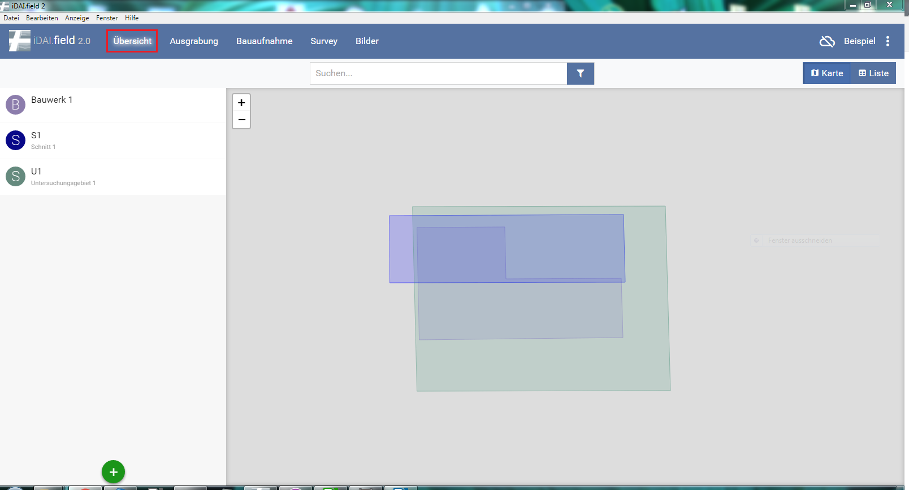
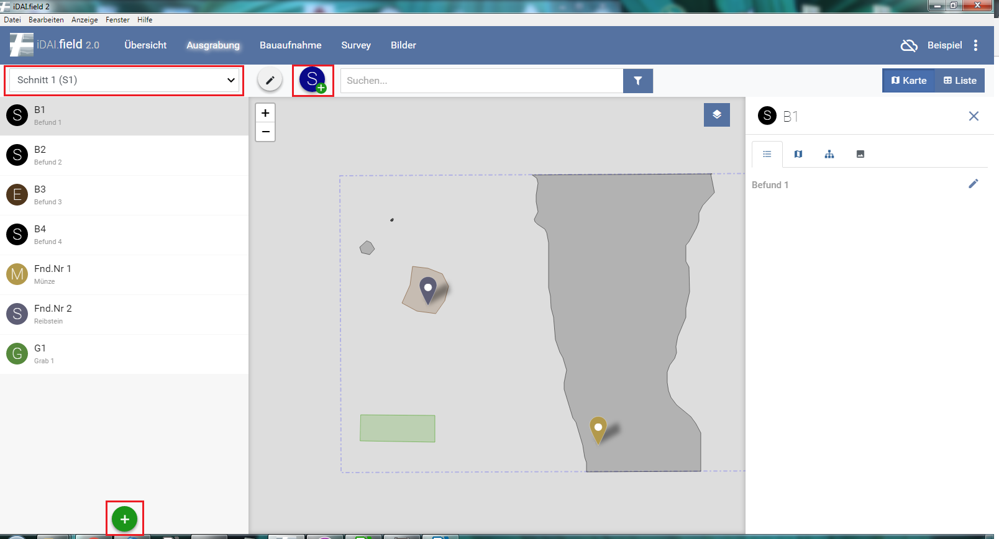

## 3. Der Client und das Anlegen von Ressourcen

*Abb. 3: Der Übersichtsbildschirm*

Startseite des Clients. In diesem Bereich werden die verschiedenen Menü-Ebenen beschrieben. Rechts oben wird angezeigt, ob der Client zu einem anderen oder zum Server synchronisiert 
sowie der Projektname (Beispiel).\
*(siehe: Abschnitt 7 Das Projekt, Abschnitt 5 Synchronisation mit anderen Client(s))*

### 3.1 Übersicht

Der Übersichts-Bildschirm: Hier können Ressourcen
angelegt werden und das gesamte Projekt überblicksartig betrachtet
werden. Das Anlegen von Ressourcen geschieht über den  Button. Hier
können nur Haupttypen angelegt werden. Schnitte, Bauaufnahmen, Survey
Areale und Orte.\

### 3.2 Maßnahmen

Die drei Maßnahmen Ausgrabung, Bauaufnahmen und Survey, werden über gleichnamige Reiter in der oberen Leiste ausgewählt.\
In diesen Bereichen können alle Ressourcen eingesehen und bearbeitet werden. Die Zuordnung zur Maßnahme erfolgt automatisch, weitere Ressourcen werden immer innerhalb einer Maßnahme angelegt.\
Jede Ressource kann ausgewählt werden, auf der rechten Seite wird eine
Übersicht der eingetragenen Felder und deren Attribute angezeigt. Das
Anlegen von Ressourcen geschieht über den  Button. Zudem können
weitere Schnitte, Bauaufnahmen oder Surveys über ,  und
 hinzugefügt und bearbeitet werden .\

*Abb 4: Der Maßnahme-Bildschirm*

### 3.3 Einstellungen

Im Einstellungs-Fenster wird der/die aktuelle BenutzerIn, also
BearbeiterIn eingetragen. Diese Information wird automatisch in die
Datensätze geschrieben. Das Feld sollte nicht leer bleiben.\
*(siehe: Abschnitt 5 Synchronisation mit anderen Clien(s))*

*Abb. 5: Einstellungsfenster*

### 3.4 Anlegen von Ressourcen

Je nach Reiter, Ausgrabung, Bauaufnahme oder Survey, wird über das
Symbol  im unteren Bereich Bereich des Ressourcensymbols ein neuer Schnitt, neues
Bauwerk oder Survey angelegt.
Nach dem Speichern der Ressource wird diese im Auswahlfenster links
angezeigt. Hier kann zwischen verschiedenen Schnitten, Bauwerken oder
Surveys gewechselt werden. Das  ermöglicht die weitere Bearbeitung
der Ressource.\
Ist eine Hauptressource angelegt können im linken Bildschirmabschnitt
über das  neue Ressourcen hinzugefügt werden. Diese beinhalten unter
anderem Befunde, Funde, Gräber, Architektur, Bohrungen, Proben u.s.w.\
Jedes ist mit einem eigenen Symbol mit Anfangsbuchstaben gekennzeichnet.

*Abb. 6: Anlegen von Hauptressourcen*

Bei der Auswahl einer neuen Ressource öffnet sich das Fenster zur
Eingabe einer Geometrie und nach der Auswahl, dass Fenster zur
Dateneingabe.

### 3.5 Felder

Unter manchen Feldern findet ein Feld ohne Eingabemöglichkeit mit einem
kleinen, grauen „Hinzufügen“ und einem . Dies öffnet ein weiteres
Fenster zur Eingabe exakter Information. Das Eingeben mehrerer Felder
ist hier möglich.
In manchen Feldern muss eine Auswahl aus einer bestehenden Tabelle
gewählt werden.
Hier werden durch die Eingabe von Anfangsbuchstaben Vorschläge gemacht.
Einige Felder gestatten nur die Eingabe von Informationen in einem
speziellen Format.
Die Eingabe eines Wortes in einem Feld, welches nur Zahlen zulässt führt
z.B. zu der Fehlermeldung , welche lediglich bedeutet, dass eine
Information nicht im korrekten Format eingegeben wurde.

### 3.6 Relationen

Beim Doppelklick auf eine Ressource, öffnet sich das
Bearbeitungsfenster.
Unter dem Reiter „Relationen“ können diese für die
Ressource, in Verbindung zu anderen, eingetragen werden.\
Unter den verschiedenen Auswahlmöglichkeiten befindet sich ein 
Button. Durch einfaches Klicken öffnet sich ein Textfeld. Hier kann die
Bezeichnung einer anderen Ressource eingegeben werden. Automaitische
Vorschläge von den bereits bestehenden werden hier angezeigt. Einfaches
Klicken darauf lässt die Relation entstehen.\
Roter Button  zur linken löscht die Relation.

### 3.7 Zuweisen von Ober- bzw. Subtypen

Es ist möglich, Ressoucen vom Typ Stratigrafische Einheit beispielsweise
einem spezielleren Typ zuzuweisen (beispielsweise Grab). Dies trifft nur
auf Ressourcen des gleichen Typs zu.\
Hier entstehen dann zusätzliche Felder.
