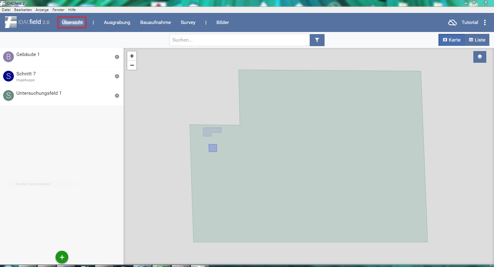
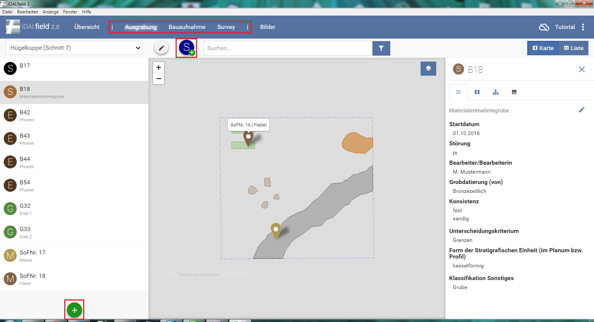
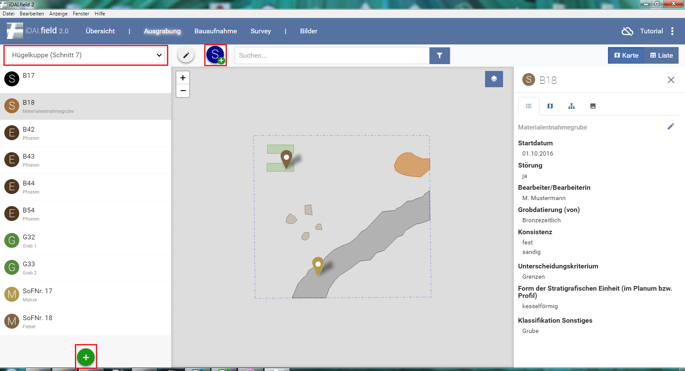
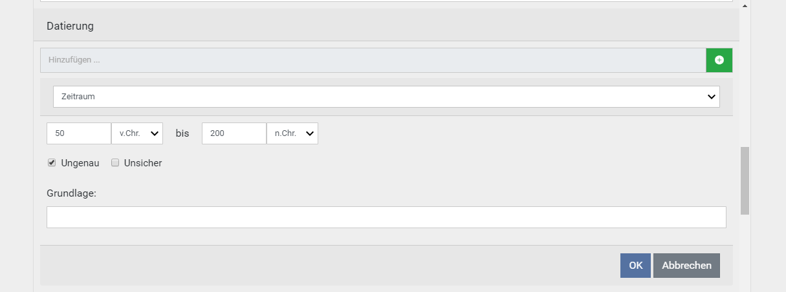
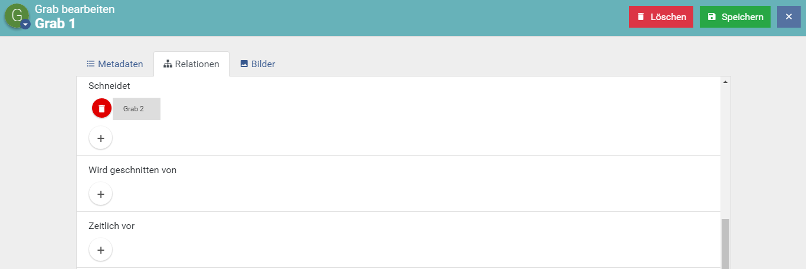
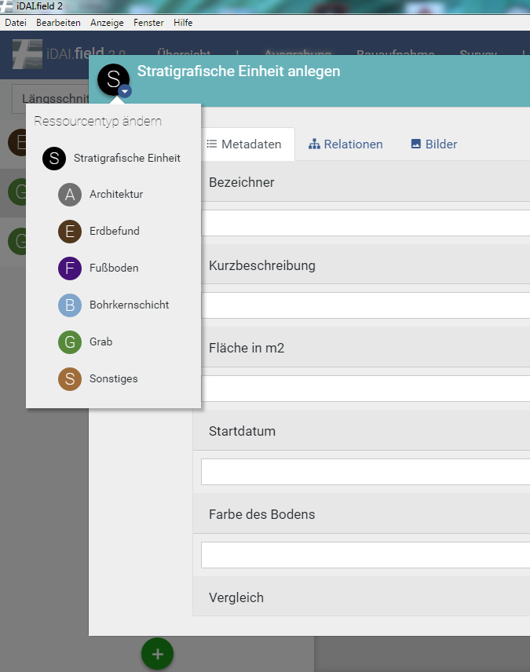

## 4. Das Arbeiten mit Ressourcen

*Abb. 4: Der Übersichtsbildschirm*

Startseite des Clients. In diesem Bereich werden die verschiedenen Menü-Ebenen beschrieben. Rechts oben wird angezeigt, ob der Client zu einem anderen oder zum Server synchronisiert 
sowie der Projektname (Beispiel).\
*(siehe: Abschnitt 2 [Das Projekt](../../manual/02._project), Abschnitt 7 [Synchronisation mit anderen Clients(s)](../../manual/07._sync))*

### 4.1 Die Maßnahmen-Übersicht

Die Maßnahmen-Übersicht: Hier können Ressourcen
angelegt werden und das gesamte Projekt überblicksartig betrachtet
werden. Das Anlegen von Ressourcen geschieht über den  Button. Hier
können Maßnahmen (Schnitte, Bauaufnahmen, Survey
Areale) und Orte angelegt werden.

### 4.2 Die Maßnahmen-Ansichten

Die drei Maßnahmen Ausgrabung, Bauaufnahmen und Survey, werden über gleichnamige Reiter in der oberen Leiste ausgewählt.\
In diesen Bereichen können alle Ressourcen eingesehen und bearbeitet werden. Die Zuordnung zur Maßnahme erfolgt automatisch. Weitere Ressourcen werden immer innerhalb einer Maßnahme angelegt.\
Jede Ressource kann ausgewählt werden, auf der rechten Seite wird eine
Übersicht der eingetragenen Felder und deren Attribute angezeigt. Das
Anlegen von Ressourcen geschieht über den  Button. Zudem können
weitere Schnitte, Bauaufnahmen oder Surveys über ,  und
 hinzugefügt und bearbeitet werden .

*Abb 5: Der Maßnahme-Bildschirm*

### 4.4 Anlegen von Ressourcen

Je nach Reiter, Ausgrabung, Bauaufnahme oder Survey, wird über das
Symbol  im unteren Bereich Bereich des Ressourcensymbols ein neuer Schnitt, neues
Bauwerk oder Survey angelegt.
Nach dem Speichern der Ressource wird diese im Auswahlfenster links
angezeigt. Hier kann zwischen verschiedenen Schnitten, Bauwerken oder
Surveys gewechselt werden. Das  ermöglicht die weitere Bearbeitung
der Ressource.\
Ist eine Hauptressource angelegt können im linken Bildschirmabschnitt
über das  neue Ressourcen hinzugefügt werden. Diese beinhalten unter
anderem Befunde, Funde, Gräber, Architektur, Bohrungen, Proben u.s.w.\
Jedes ist mit einem eigenen Symbol mit Anfangsbuchstaben gekennzeichnet.

*Abb. 6: Anlegen von Hauptressourcen*

Bei der Auswahl einer neuen Ressource öffnet sich das Fenster zur
Eingabe einer Geometrie und nach der Auswahl, dass Fenster zur
Dateneingabe. Hier ist es Notwendig einen Eintrag in das Feld "Bezeichner" zu machen. Hierbei handelt es sich um das einzige
Pflichtfeld. Hier wird eine Eingabe nach gleichem Schema mit möglichst alphabetischem Hintergrund empfohlen. 
Dies unterstützt die Sortierung und die Suche (Abb. 7).
Das Feld der "Kurzbeschreibung" ist hingegen optional. Die Eingabe hier erscheint jedoch ebenfalls in der Ressourcenbezeichnung
als visuelle Hilfe auf. Sie steht dann unter dem Bezeichner.

*Abb. 7: Bezeichnerfeld in der Ressource*

### 4.5 Eingabefelder

Unter manchen Feldern befindet ein Feld ohne Eingabemöglichkeit mit einem
kleinen, grauen „Hinzufügen“ und einem . Dies öffnet ein weiteres
Fenster zur Eingabe exakter Information. Das Eingeben mehrerer Felder ist hier möglich. Dies bedeutet, dass auch mehrere Eingaben einer Relation
gemacht werden können. Nach der Eingabe einer Information, kann durch einfaches Klicken auf 
eine weitere Eingabe in derselben Relation erfolgen. So ist z.B. eine mehrfache Eingabe für "Breite" möglich. 
Die erweiterten Eingabefelder ermöglichen hierfür die Angabe, an welchem Punkt die Maße abgenommen wurde.

In manchen Feldern muss eine Auswahl aus einer bestehenden Tabelle getroffen werden.
Hier werden durch die Eingabe von Anfangsbuchstaben Vorschläge gemacht (Abb. 8).
Einige Felder gestatten nur die Eingabe von Informationen in einem speziellen Format.
Die Eingabe eines Wortes in einem Feld, welches nur Zahlen zulässt führt
z.B. zu der Fehlermeldung , welche lediglich bedeutet, dass eine
Information nicht im korrekten Format eingegeben wurde.

Es ist möglich sich mit der Hilfe bestimmter Tasten auf der Tastatur schnell durch das Eingabefenster zu bewegen.\
Mit der Tab-Taste wechselt man das Eingabefeld vorwärts. Mit der Kombination shift und Tab wechselt man das Eingabefeld rückwärts.
Bei anwählbaren Checkboxen wird das entsprechende mit der Leertaste angewählt. Bei ausklappbaren Auswahlfeldern öffnet die Entertaste die Auswahl. Durch diese kann dann mittels der Pfeiltasten rauf und runter eine Auswahl getroffen werden. Diese wird durch ein erneutes betätigen von Enter bestätigt.

*Abb. 8: Erweitertes Eingabefeld*

### 4.6 Relationen

Beim Doppelklick auf eine Ressource, öffnet sich das
Bearbeitungsfenster.
Unter dem Reiter „Relationen“ können diese für die
Ressource, in Verbindung zu anderen, eingetragen werden.\
Unter den verschiedenen Auswahlmöglichkeiten befindet sich ein 
Button. Durch einfaches Klicken öffnet sich ein Textfeld. Hier kann die
Bezeichnung, aus dem Bezeichner-Feld, einer anderen Ressource eingegeben werden. Automaitische
Vorschläge von den bereits bestehenden werden hier angezeigt. Einfaches
Klicken darauf lässt die Relation entstehen (Abb. 9).\
Roter Button  zur linken löscht die Relation.
Wurden zwei Ressourcen verbunden, steht die Relation am rechten Ressourcenbildschirm unter dem Reiter Relation (Abb. 10).
Durch einfaches Klicken auf die verknüpfte Ressource kann zu dieser gewechselt werden.

\
*Abb. 9: Anlegen der Relationen*

\
*Abb. 10: Relation im Ressourcenbildschirm*

### 4.7 Zuweisen von Ober- bzw. Subtypen

Beim Anlegen von Ressourcen ist es möglich, einen Obertyp zu wählen und somit die Definition noch nicht exakt fest zu legen.
Beispielsweise kann im Bereich der stratigraphischen Einheit der gleichnamige Obertyp über den Button 
angelegt und später exakt zu einem Subtyp umgewamdelt werden (Abb 11).\
Dies ist zu jedem späteren Zeitpunkt durch einfaches Klicken auf einen Subtyp in dieser Auswahl möglich.\
Auch ein Wechsel zwischen zwei Subtypen oder eine Rückkerhr zum Obertyp kann vollzogen werden.\
Allerdings ist hier dringend zu beachten, dass einige Felder spezifisch für manche Ressourcen sind und hier eingetragende Informationen
bei einem Wechsel verloren gehen werden. Die Datenbank wird auf einen solchen Verlust mit einer Meldung im oberen, rechten Bereich hinweisen.
In diesem Hinweis sind die Felder benannt, bei denen Informationen durch einen Wechsel des Typs verloren gehen werden.

\
*Abb. 11: Relation im Ressourcenbildschirm*
