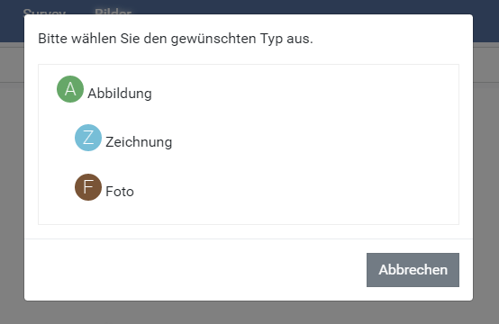
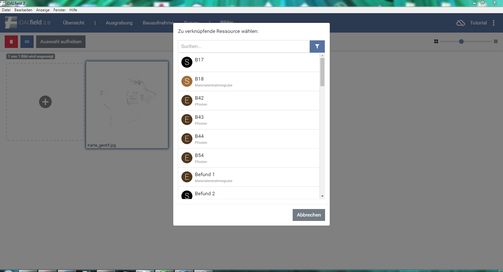
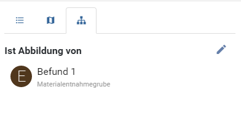

## 5 Bilder

\
*Abb 12: Typauswahl der Abbildung*

Hier können Abbildungen hinzugefügt werden. Nach dem Klicken auf den
„Abbildung hinzufügen“ Bereich, erfolgt eine Auwahl über den Browser.
Unterstützt werden die Formate jpeg und png. Alternativ die Bilder
per drag-and-drop fallen lassen. Bitte beachten Sie, dass der image-Pfad
gesetzt ist *(siehe: Quickstart)*\
Die Bilder können auch direkt über die Ressource in der Maßnahmenansicht per drag-and-drop im Bilderbereich an der rechten Seite (markierter roter bereich) fallen gelassen werden.
In diesem Fall wird das Bild automatisch mit der Ressource verknüpft. Ebenfalls ist es möglich die Bilder per drag-and-drop in die
Listenansicht einzufügen und so automatisch den Ressourcen zuzuordnen (Abb. 13). 
Im Anschluss kann ausgewählt werden, ob es sich um eine Zeichnung, Fotografie
oder Abbildung handelt (Abb. 12)\
In der recten, oberen Ecke befindet sich ein Regler mit welchem die Bildgröße angepasst werden kann.\
Nun kann die Abbildung mit einer oder mehreren Ressourcen verknüpft werden .\
Anschließend kann die abgebildete Ressource ausgewählt werden (Abb. 14/15).

\
*Abb 13: Hinzufügen in der Maßnahmenansicht*

\
*Abb 14: Zuweisung von Ressourcen*

*Abb 15: Foto mit verknüpfter Ressource*

### 5.1 Einzelansicht und Relationen

Mit einem doppelklick auf das Bild wird dieses in einer großen Einzelansicht geöffnet. Am rechten Rand stehen hier die Bildinformationen.
Mit dem Bearbeitungsbutton  können weitere
Fotoattribute eingetragen werden. Hier finden sich auch die Reiter zu den Georeferenzdaten und den Relationen (Abb. 16).
Mit einfachem Klicken kann hier die verlinkte Ressource aufgerufen werden.
Wir das Bild per drag-and-drop im Ressourcenbildschirm eingefügt wird es direkt an diese Ressource angehängt.\
Soll solch eine Verknüpfung gelöscht werden, muss die
Abbildung unter dem Reiter Bilder doppelt angeklickt werden. Alternativ
kann über die verknüpfte Ressource darauf zugegriffen werden, indem man
hier das Bild vergrößert. In beiden Fällen stehen am rechten Rand die
Bildinformationen zur Verfügung. Über  und den Reiter „Relationen“
lassen sich die Verknüpfungen anzeigen und löschen.

\
*Abb 16: Verknüpfte Ressource*

### 5.2 World Files und Georeferenzierung

Ein weiteres Feature ist die Zuweisung
von Georeferenzdaten (Abb. 17/18), um Hintergrundkarten zu erstellen.
Hierfür wird eine Rastergrafik und eine .wld-Datei benötigt,
welche die Koordinaten des Bildes enthält. Durch den Klick auf  kann
das .wld hinzugefügt werden. Nun ist es als Hintergrundkarte verfügbar
und kann in den verschiedenen Bildschirmen aus- oder angeschaltet
werden. Anschließend ändert sich die Anzeige bei Georeferenzdaten in .\
Wichtig ist hier, dass eine Kurzbeschreibung vorhanden ist, welche als
Überschrift der Basiskarten verwendet wird.\
Jeder Layer kann an- und ausgeschaltet  und zentriert
 werden.

*Abb 17: Hintergrundkarte*

\
*Abb 18: Georeferenzbildschirm*
