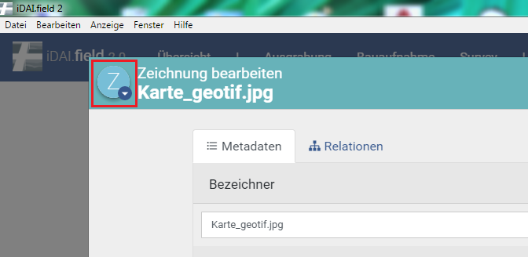
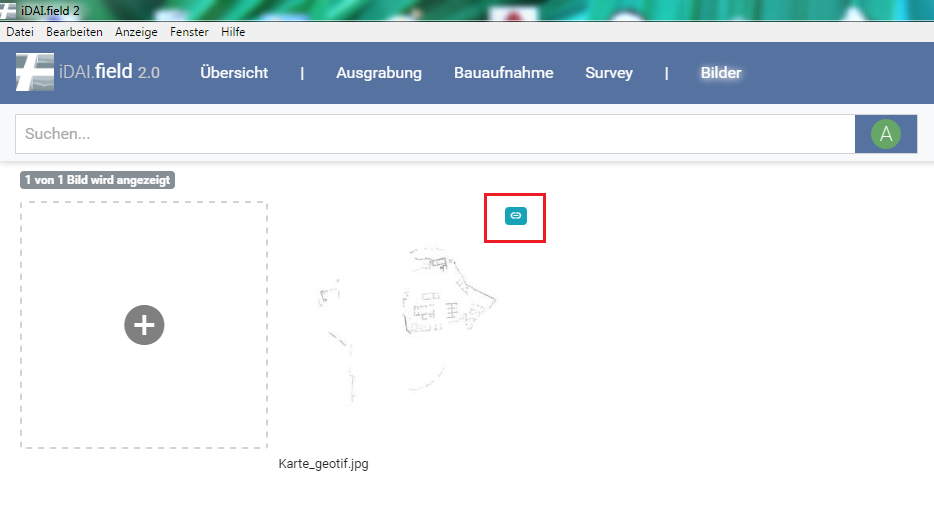
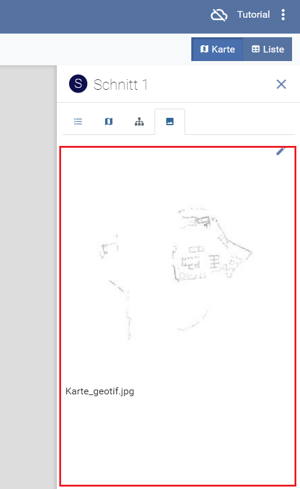
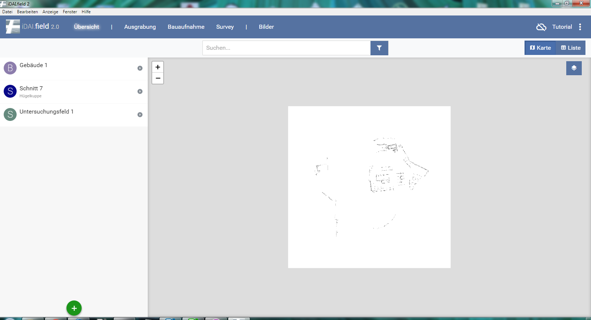

## 5 Bilder

\
*Abb 12: Bereich Bilder*

Im Abschnitt Bilder (Abb. 12) können Abbildungen hinzugefügt werden.\
Dies ist durch einfaches klicken auf den, mit einer gestrichelten Linie umrahmten, Bereich möglich.
Hier erfolgt eine Auwahl über den Browser.
Unterstützt werden die Formate jpeg und png.
Alternativ können die Bilder per drag-and-drop im markierten Bereich fallen gelassen werden. Bitte beachten Sie, dass der image-Pfad
gesetzt ist *(siehe: Quickstart).*\
Nach dem hinzufügen der Abbildung muss eine Auswahl getroffen werden, ob es sich um eine Zeichnung, eine Fotografie
oder eine Abbildung handelt (Abb. 13).

\
*Abb 13: Auswahl der Abbildungsart*

Dies ist wichtig, da über die Suchabfrage in der oberen Zeile ein Filter nach Abbildungen, Fotos und zeichnungen eingestellt werden kann.
Rechts neben dem Suchen-Feld ist es möglich eine Auswahl nach erstellten und angelegten Ressourcen zu treffen.
In der rechten, oberen Ecke befindet sich ein Regler. Mit diesem kann die Bildgröße angepasst werden. (Siehe Abb. 12)\
Zum Verknüpfen der Bilder mit einer oder mehreren Ressourcen genügt ein einfacher Klick auf den .
Anschließend kann die abgebildete Ressource ausgewählt werden (Abb. 14/15).

\
*Abb 14: Zuweisung von Ressourcen*

\
*Abb 15: Foto mit verknüpfter Ressource*

Ebenso ist es möglich, die Bilder direkt über die Ressource in der Maßnahmenansicht per drag-and-drop im Bilderbereich an der rechten Seite
(markierter roter bereich in Abb. 16) fallen zu lassen.
In diesem Fall wird das Bild automatisch mit der gewählten Ressource verknüpft. Ausserdem ist es möglich die Bilder per drag-and-drop in die
Listenansicht einzufügen und so automatisch der Ressourcen zuzuordnen.

\
*Abb 16: Hinzufügen in der Maßnahmenansicht*

### 5.1 Einzelansicht und Relationen

Mit einem doppelklick auf das Bild wird dieses in einer großen Einzelansicht geöffnet. Am rechten Rand stehen hier die Bildinformationen.
Mit dem Bearbeitungsbutton  können weitere
Fotoattribute eingetragen werden. Hier finden sich auch die Reiter zu den Georeferenzdaten und den Relationen (Abb. 17).
Mit einfachem Klicken kann hier die verlinkte Ressource aufgerufen werden.
Wir das Bild per drag-and-drop im Ressourcenbildschirm eingefügt wird es direkt an diese Ressource angehängt.\
Soll solch eine Verknüpfung gelöscht werden, muss die
Abbildung unter dem Reiter Bilder doppelt angeklickt werden. Alternativ
kann über die verknüpfte Ressource darauf zugegriffen werden, indem man
hier das Bild vergrößert. In beiden Fällen stehen am rechten Rand die
Bildinformationen zur Verfügung. Über  und den Reiter „Relationen“
lassen sich die Verknüpfungen anzeigen und löschen.

\
*Abb 17: Verknüpfte Ressource*

### 5.2 World Files und Georeferenzierung

Ein weiteres Feature ist die Zuweisung
von Georeferenzdaten (Abb. 18/19), um Hintergrundkarten zu erstellen.
Hierfür wird eine Rastergrafik und eine .wld-Datei benötigt,
welche die Koordinaten des Bildes enthält. Durch den Klick auf  kann
das .wld hinzugefügt werden. Nun ist es als Hintergrundkarte verfügbar
und kann in den verschiedenen Bildschirmen aus- oder angeschaltet
werden. Anschließend ändert sich die Anzeige bei Georeferenzdaten in .\
Wichtig ist hier, dass eine Kurzbeschreibung vorhanden ist, welche als
Überschrift der Basiskarten verwendet wird.\
Jeder Layer kann an- und ausgeschaltet  und zentriert
 werden.

*Abb 18: Hintergrundkarte*

\
*Abb 19: Georeferenzbildschirm*
