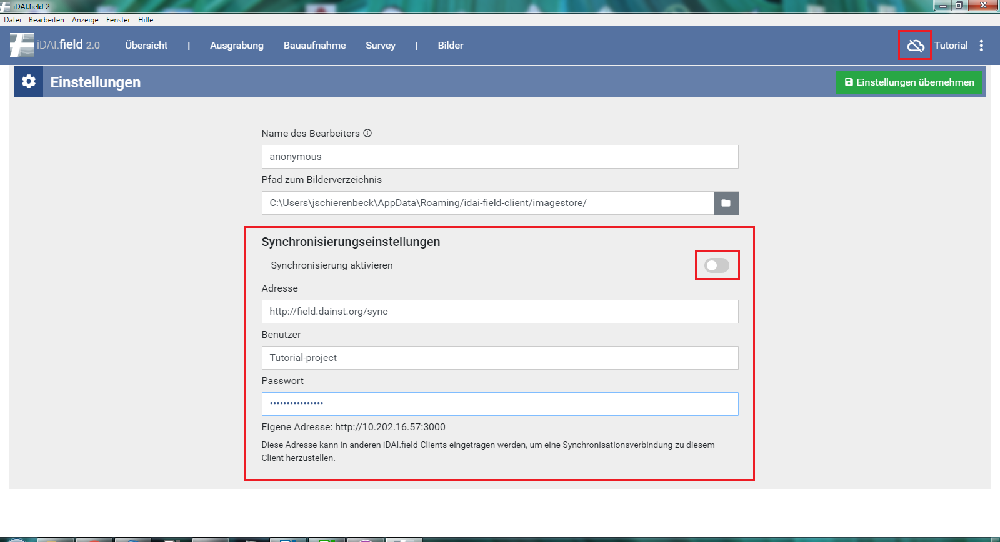

## 7. Synchronisation mit anderen Client(s)

Der Client kann stets mit einem, oder mehreren anderen Clients verbunden
und Synchronisiert werden. Das Symbol  zeigt an, ob der Client
derzeit verbunden ist. Durchgestrichene Wolke: Keine Verbindung. Durch einfaches klicken auf die Wolke werden die Synchronisationseinstellungen aufgerufen.

### 7.1 Synchronisation mit einem anderen Client

Über den Reiter Einstellungen werden die
„Synchronisierungseinstellungen“ eingegeben. Die Felder „Benutzer“ und
„Passwort“ sind bei einer einfachen Verbindung nicht erforderlich. Nur,
wenn zu einem Server Synchronisiert wird, muss der Projektname
eingetragen werden.\
Die Synchronisation läuft so lange, bis die Adresse aus dem Feld
gelöscht und die Einstellungen übernommen werden.

### 7.2 Synchronisation mit mehreren Clients

Bei der Synchronisation mit mehreren anderen Clients existieren zwei
Möglichkeiten.\
Im ersten Fall synchronisieren mehrere Rechner zu einem Masterclient und
geben hierfür alle die Adresse dieses Clients in den Einstellungen an.\
Im Zweiten Fall bilden mehrere Rechner eine Kette und der erste
synchronisiert zum zweiten, dieser zum dritten u.s.w. Hierfür wird die
Adresse des jeweils nächsten in den Einstellungen verwendet. Das
Synchronisieren untereinander ist zwar bei zwei Clients möglich, könnte
allerdings zu fehlern führen.

### 7.3 Synchronisation über den Server field.dainst.org

*Abb 21: Synchronisationseinstellungen*

Zuerst müssen die Mitarbeiterinnnen und Mitarbeiter des
IT-Referats des DAI ein Projekt auf dem Server anlegen. Bei der
Synchronisation mit dem Server ist es weiterhin nötig, dass die
spezifische Serveradresse eingetragen wird.

http://field.dainst.org/sync

Der Name des Projektes muss in diesem Fall im Benutzerfeld stehen und
das Passwort ist standardmäßig der Name des Projekts.
Zudem muss der Name des Projektes mit dem auf dem Server angelegten
Projekt übereinstimmen.
