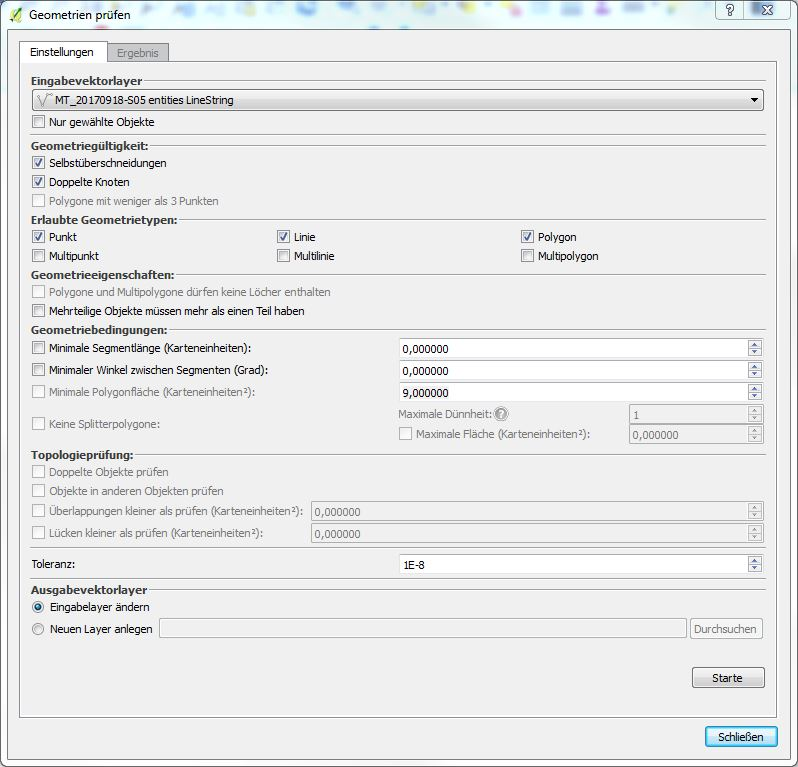

## 8. Integration von Messdaten aus AutoCAD

Bei der Integration von Daten aus CAD müssen diese zuvor in GIS geladen
und von dort in das Format geoJSON überführt werden, damit die Datenbank
diese Messdateien aufnehmen kann.\
QGIS ist in der Lage DXF.-Dateien zu laden. Jedoch sind ein paar weitere
Arbeiten notwendig.\
Zum ersten muss die Datei als DXF. Vorliegen. Diese kann als Vektorlayer
im GIS geladen werden.\
Dieser Layer muss als shape (shp.) gespeichert werden. Über den Reiter
„Vektor“ muss im Unterpunkt „Geometrie-Werkzeuge“ die Anwendung
„Geometrie Prüfen“ ausgewählt werden. Ist diese nicht vorhanden muss sie
als Plugin installiert oder/und zugeschaltet werden.\
Im Anschluss muss ein neues GRASS-Mapset erstellt werden. Der
Eingabelayer muss ausgewählt und ein Ausgabelayer definiert werden. Nach
drücken des „Start“ Buttons, kann das Ergebnis visualisiert werden.

\
*Abb. 20: Geometrien Prüfen*

Vor dem umwandeln in Polygone muss die Datei durch das Tool bearbeitet
werden. Hier werden alle noch frei stehenden Linien geschlossen, sodass
sie weiter verarbeitet werden können.

*Abb. 21: v.Clean Bereinigungswerkzeug*

Im Reiter „Cleaning Tool“ muss snap eingestellt sein. Dies ist nicht der
Standard. Bei „Threshold“ wird die Entfernung eingegeben in welcher
Linien gesnapt werden, Diese darf nicht zu groß sein, empfohlen wird
hier 0,001 (10 cm). Es kann jedoch notwendig sein, diese Entfernung auf
die eigenen Daten an zu passen.\
Die so entstandenen Layer können mit dem Tool „Linien zu Plygonen“, zu
finden unter dem Reiter Vektor und dem Bereich Geometrie-Werkzeuge, in
Polygone umgewandelt werden.

Abb. 22: Linien zu Polygonen

Ein Problem stellen fehlende Außenlinien dar. Diese sind bei manchen
CAD-Zeichnungen nicht unbedingt vorhanden, wie im unten angegebenen
Beispiel. Hier muss für den Befund 026 eine Außenlinie definiert werden.
Dies muss leider händisch erfolgen und ist vor der Anwendung Linien zu
Polygon vor zu nehmen.

Abb. 23: Beispiel CAD-Plan

Für die Integration in den iDAIfield Client müssen die Layer natürlich
mit einem Identifier-Feld versehe werden. Sollen Befundnummern mit
übertragen werden ist das anlegen von Punktlayern zu diesem Zweck ein
einfacher Weg.
