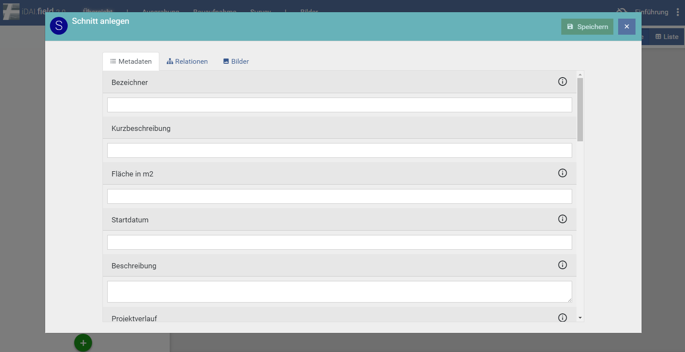
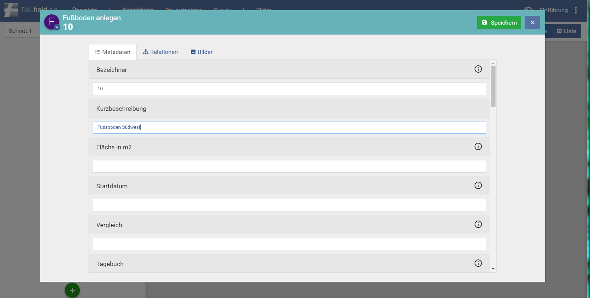
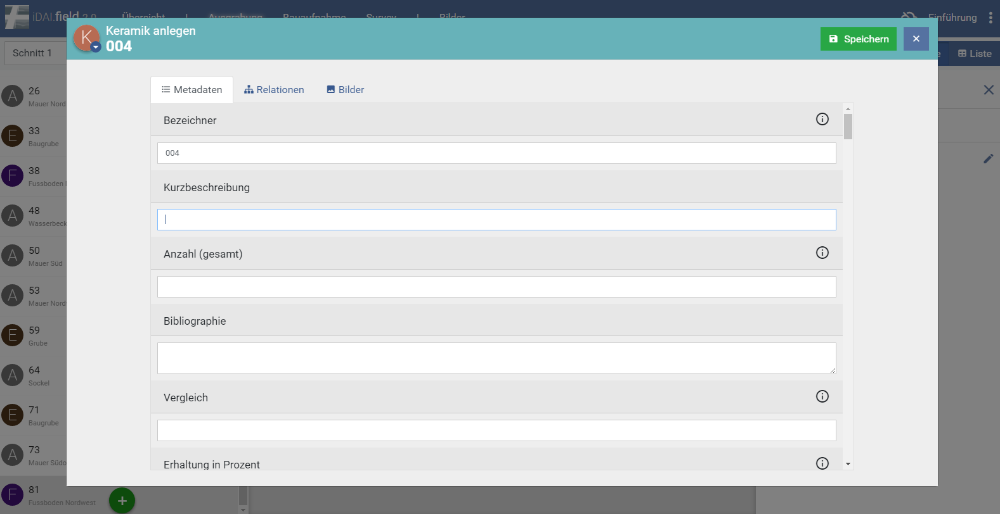
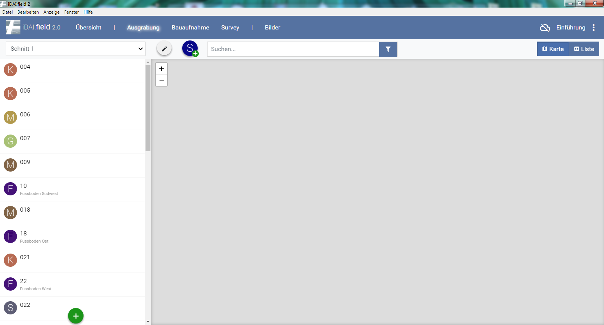
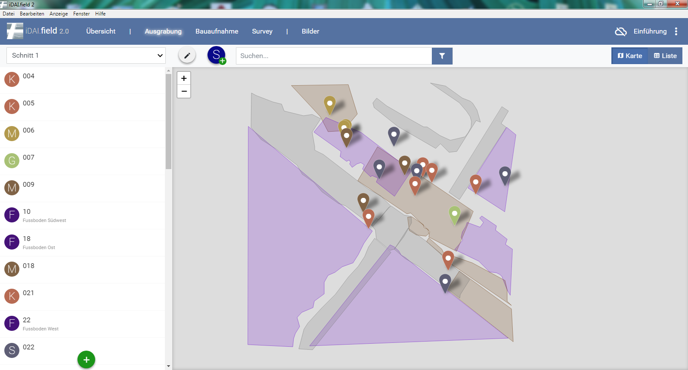

## 3. Anlegen von Ressourcen in iDAI-Field 2.0

Die Vorbereitungen der Messdaten sind abgeschlossen. Als nächstes müssen die Ressourcen in der Datenbank angelegt werden.
Für Informationen zum starten der Datenbank und die ersten Schritte schauen Sie bitte unter: *(siehe: [Quickstart](../../manual/01._quickstart)).*\
Als erstes wird in der Hauptansicht ein Schnitt angelegt. (Abb. 4) In diesem werden über das  Ressourcen hinzugefügt.\
(Abb. 5 und 6).

\
*Abb 4: Anlegen eines Schnittes*

\
*Abb 5: Anlegen von Befunden*

\
*Abb 6: Anlegen von Befunden*

Wählen Sie keine Geometriedaten aus, da diese später als GeoJSON hinzugefügt werden.
Im ersten Feld „Bezeichner“ benennen Sie die Ressource mit der Befund- oder Fundnummer.
Für weitere Informationen zum Anlegen von Ressourcen schauen Sie bitte unter: *(siehe: [Das Arbeiten mit Ressourcen](../../manual/04._client)).*
Legen Sie für die Testdaten folgende Ressourcen an.

- Fußboden Befundnummer 10
- Fußboden Befundnummer 18
- Fußboden Befundnummer 22
- Erdbefund Befundnummer 23
- Architektur Befundnummer 26
- Erdbefund Befundnummer 33
- Fußboden Befundnummer 38
- Architektur Befundnummer 48
- Architektur Befundnummer 50
- Architektur Befundnummer 53
- Erdbefund Befundnummer 59
- Architektur Befundnummer 64
- Erdbefund Befundnummer 71
- Erdbefund Befundnummer 72
- Architektur Befundnummer 73
- Fußboden Befundnummer 81

- Keramik Fundnummer 004
- Keramik Fundnummer 005
- Münze Fundnummer 006
- Glas Fundnummer 007
- Metall Fundnummer 009
- Metall Fundnummer 018
- Keramik Fundnummer 021
- Stein Fundnummer 022
- Stein Fundnummer 023
- Stein Fundnummer 024
- Münze Fundnummer 025
- Metall Fundnummer 026
- Keramik Fundnummer 031
- Münze Fundnummer 032
- Stein Fundnummer 033
- Stein Fundnummer 034
- Keramik Fundnummer 039
- Keramik Fundnummer 040

\
*Abb 6: Angelegte Ressourcen in der Übersicht*

Wählen Sie über „Import“ das dateiformat GeoJSON und wählen Sie eine der vorbereiteten Dateien aus. (Abb. 7)\
Importieren Sie die Befund- und die Funddatei. Die Geometriedaten werden automatisch den Ressourcen zugeordnet.

\
*Abb 7: Import des GeoJSON*

\
*Abb 8: Importierte Befunde und Funde*