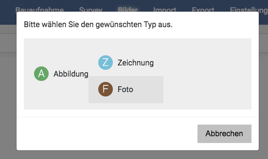
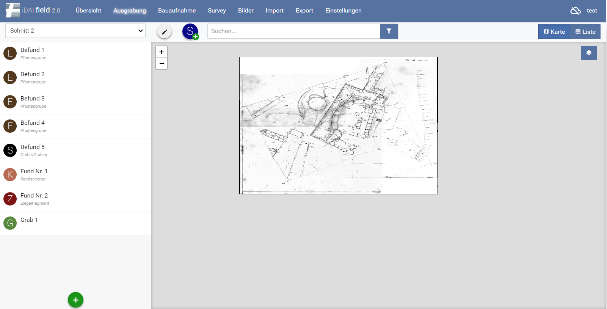
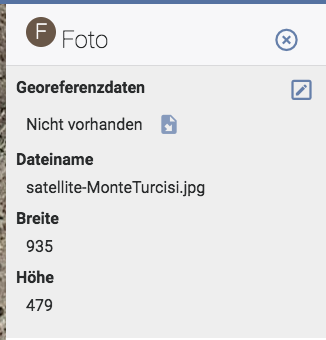

## 2.5 Bilder

\
*Abb 6: Typauswahl der Abbildung*

Hier können Abbildungen hinzugefügt werden. Nach dem Klicken auf den
„Abbildung hinzufügen“ Bereich, erfolgt eine Auwahl über den Browser.
Nur das .jpg-Format wird gegenwärtig unterstützt. Alternativ die Bilder
per drag-and-drop fallen lassen. Bitte beachten Sie, dass der image-Pfad
gesetzt ist *(siehe: Quickstart)*\
Nun kann ausgewählt werden, ob es sich um eine Zeichnung, Fotografie
oder Abbildung handelt (Abb. 6)\
Nun kann die Abbildung mit einer oder mehreren Ressourcen verknüpft werden .\
Anschließend kann die abgebildete Ressource ausgewählt werden (Abb. 7/8).

*Abb 7: Zuweisung von Ressourcen*

Zudem können selbstverständlich mit  weitere
Fotoattribute eingetragen werden. Ein weiteres Feature ist die Zuweisung
von Georeferenzdaten (Abb. 9.1), um Hintergrundkarten zu erstellen.
Hierfür wird eine Rastergrafik (.jpg) und eine .wld-Datei benötigt,
welche die Koordinaten des Bildes enthält. Durch den Klick auf  kann
das .wld hinzugefügt werden. Nun ist es als Hintergrundkarte verfügbar
und kann in den verschiedenen Bildschirmen aus- oder angeschaltet
werden. Anschließend ändert sich die Anzeige bei Georeferenzdaten in .\
Wichtig ist hier, dass eine Kurzbeschreibung vorhanden ist, welche als
Überschrift der Basiskarten verwendet wird.

*Abb 8: Foto mit verknüpfter Ressource*

*Abb 9: Hintergrundkarte*

\
*Abb 9.1: Georeferenzbildschirm*

Jeder Layer kann an- und ausgeschaltet  und zentriert
 werden.

Soll solch eine Verknüpfung gelöscht werden, muss die
Abbildung unter dem Reiter Bilder doppelt angeklickt werden. Alternativ
kann über die verknüpfte Ressource darauf zugegriffen werden, indem man
hier das Bild vergrößert. In beiden Fällen stehen am rechten Rand die
Bildinformationen zur Verfügung. Über  und den Reiter „Relationen“
lassen sich die Verknüpfungen anzeigen und löschen.

